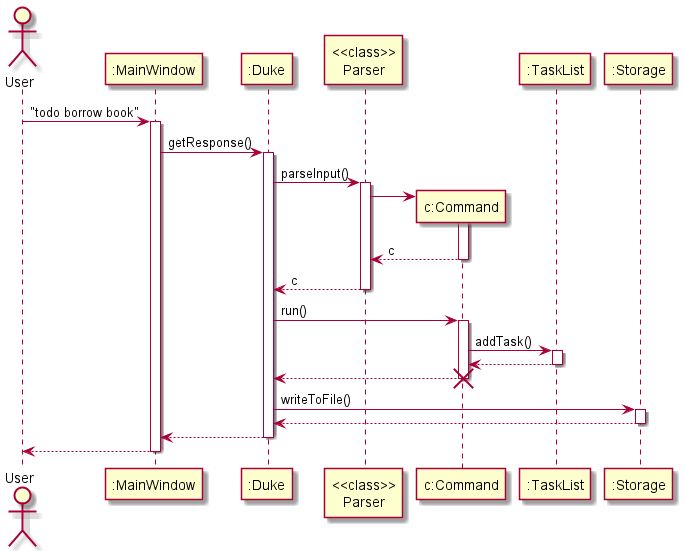

# Developer Guide

## Design

### Architecture

The *Architecture Diagram* above explains the high-level design of the app.
* `Launcher`: App entry point.
* `JavaFX` `Main`: Hold instance of `Duke`.
* `JavaFX` `MainWindow`:
  * Parent GUI of app.
  * Accept user input and trigger `Duke` logic.
* `Duke`: Main control of back-end logic.
* `Parser`: Make sense of user input.
* `Command`: Execute instruction.
* `TaskList`: Hold app data in memory.
* `Storage`: Read data from and write data to hard disk.
  

#### Interaction Between Architecture Components
The *Sequence Diagram* below shows how the components interact with each other for scenario when the user issues command `todo borrow book`.

**Note:** The lifeline for `c:Command` should end at destroy marker (X), but due to a limitation of PlantUML, the lifeline reaches the end of diagram.

## Appendix: Requirements

### User Stories
| As a | I want to | So that |
| --- | --- | --- |
| forgetful user | add task | I can action on them later |
| user | see all tasks | I can plan my execution strategy |
| user | mask a task as done | I am more productive |
| user | delete a task | I can declutter task that are no longer valid |
| user | filter tasks by keyword | I can quickly find a task |
| new user | undo previous command | I can quickly rollback a mistake |
 

### Non-Functional Requirements
1. Should work on Windows, Mac and Ubuntu with Java 11 installed.
1. Each command should execute within 5 seconds.
1. Should be able to hold up to 1000 tasks without noticeable degrade in performance.
